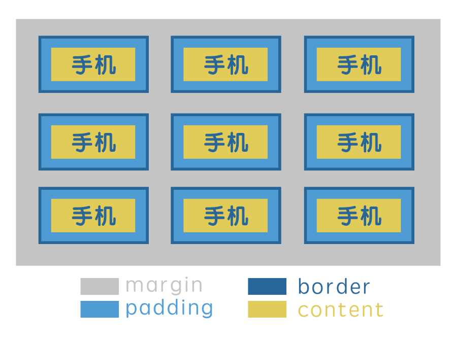
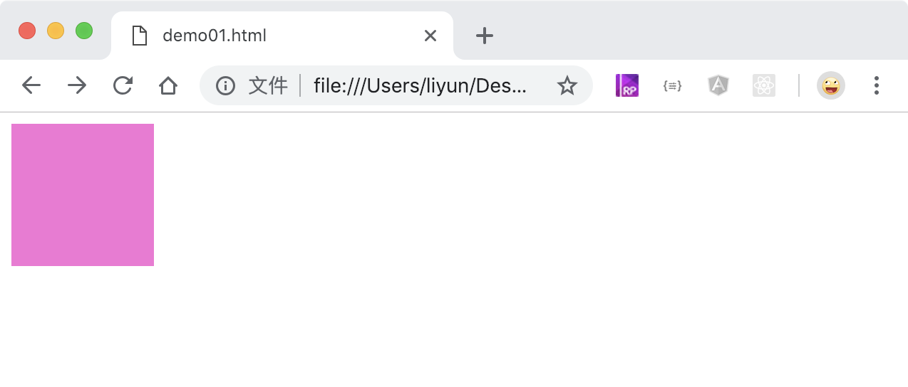
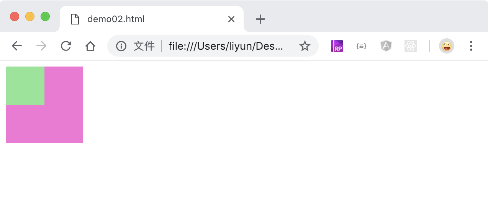

# 盒子模型

一个网页中有大量的 `div` 元素组成，每个 `div` 就好比是一个盒子，堆叠起来形成网页。每个 `div` 和盒子一样都拥有以下属性：

-   width：宽度
-   height：高度
-   padding：内边距
-   border：边框
-   margin：外边距

肥皂盒里面可以放一块肥皂，肥皂里面什么都不能放，因为肥皂本身就是一个东西。在我们的元素中，div 是一个盒子，可往里面塞任何东西，而 input、img 就不算是盒子，因为他们本身就是一个内容，没办法再往里面添加东西了。

以手机包装盒为例，包装盒本身的宽是`width`，高是`height`；最外面的硬纸壳相当于边框`border`；防止手机在盒子内摇晃的泡沫层是`padding`，盒子内容的尺寸是盒子的尺寸减去`padding`的尺寸;包装盒与包装盒之间用来防止相互膨胀的空气包算是 `margin`。画图来说就是下面这样子的:



## 设置元素的宽度和高度

`width`和`height`属性分别用来设置元素的宽度和高度

> 下面代码中的`background-color`属性，用来设置元素的背景色，以便观察每个盒子的位置。

```html
<style>
    div {
        width: 100px;
        height: 100px;
        background-color: rgb(248, 114, 215);
    }
</style>
<div></div>
```

[案例源码](./demo/demo02.html)



`width` 和 `height` 的属性值都可以用百分比来设置，各自以父级元素的宽度和高度来计算。

```html
<style>
    div {
        width: 100px;
        height: 100px;
        background-color: rgb(248, 114, 215);
    }
    p {
        width: 50%;
        height: 50%;
        background-color: rgb(136, 230, 148);
    }
</style>
<div><p></p></div>
```

[案例源码](./demo/demo03.html)



元素的默认宽度和元素的显示方式有关：

-   块级元素的默认宽度值是`auto`，表示与父级元素的内容宽度相同。
-   行内和行内块元素的默认宽度是 0，表示它们的宽度会跟随内容的多少去改变(被内容撑开)。
