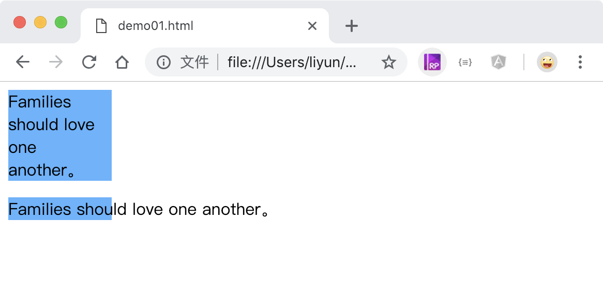
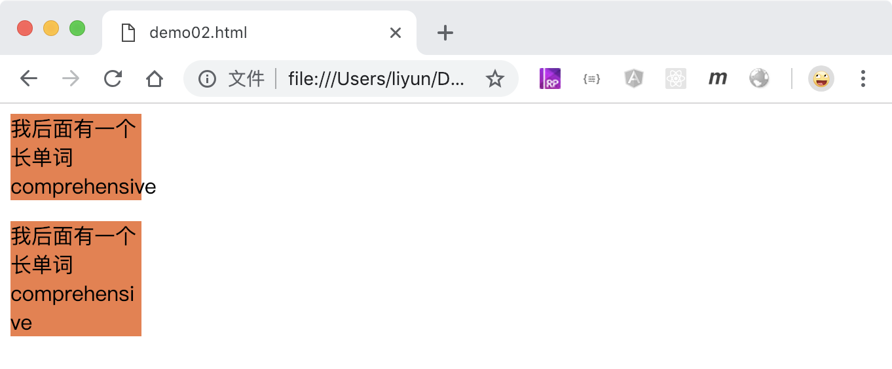
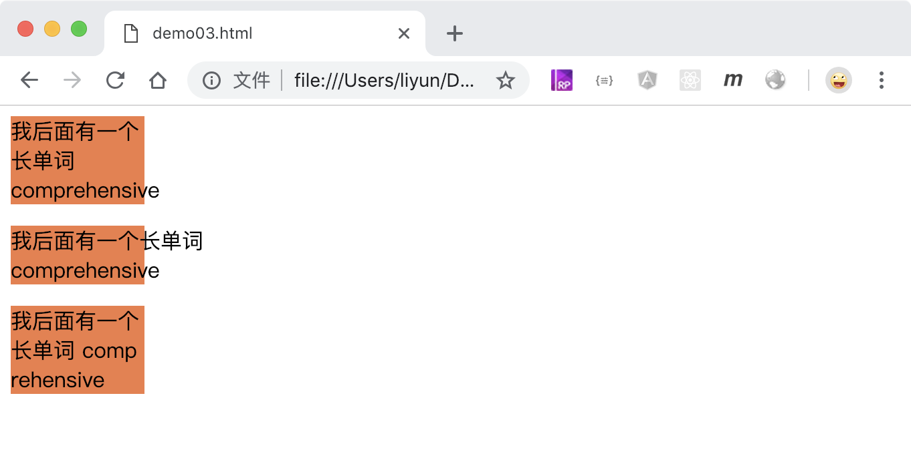

# 设置文字换行规则

`white-space`属性用来设置段落中的文字是否换行。

| 属性值   | 作用                                                                 |
| -------- | -------------------------------------------------------------------- |
| normal   | 默认值。段落中的**空白/换行符**会被浏览器忽略                        |
| pre      | **空白/换行符**会被浏览器保留。其行为方式类似 HTML 中的 <pre> 标签。 |
| nowrap   | 文本不会换行，文本会在在同一行上继续显示，直到遇到 <br> 标签为止。   |
| pre-wrap | 保留空白符序列，但是正常地进行换行。                                 |
| pre-line | 合并空白符序列，但是保留换行符。                                     |

```html
<style>
    p {
        width: 100px;
        background-color: rgb(93, 179, 255);
    }
    p:nth-child(1) {
        white-space: nromal;
    }
    p:nth-child(2) {
        white-space: nowrap;
    }
</style>
<p>Families should love one another。</p>
<p>Families should love one another。</p>
```

[案例源码](./demo/demo01.html)



## 长单词的换行规则

`word-wrap`属性用来设置文本中长单词的显示方式：

| 属性值       | 作用                                                      |
| ------------ | --------------------------------------------------------- |
| `none`       | 默认值，遇到长单词或 url 时不换行，可能会超出元素宽度显示 |
| `break-word` | 在长单词或 url 内部进行换行；                             |

```html
<style>
    p {
        width: 100px;
        background-color: rgb(241, 124, 70);
    }
    .p1 {
        word-wrap: none;
    }
    .p2 {
        word-wrap: break-word;
    }
</style>
<p class="p1">我后面有一个长单词 comprehensive</p>
<p class="p2">我后面有一个长单词 comprehensive</p>
```

[案例源码](./demo/demo02.html)



## 单词的打断规则

`word-break`属性用来设置单词的打断规则

| 属性值      | 作用                                 |
| ----------- | ------------------------------------ |
| `normal`    | 默认值，按照浏览器默认规则打断长文本 |
| `keep-all`  | 只能在半角空格或连字符处换行。       |
| `break-all` | 允许在单词内换行                     |

```html
<style>
    p {
        width: 100px;
        background-color: rgb(241, 124, 70);
    }
    .p1 {
        word-break: none;
    }
    .p2 {
        word-break: keep-all;
    }
    .p3 {
        word-break: break-all;
    }
</style>
<p class="p1">我后面有一个长单词 comprehensive</p>
<p class="p2">我后面有一个长单词 comprehensive</p>
<p class="p3">我后面有一个长单词 comprehensive</p>
```

[案例源码](./demo/demo03.html)


